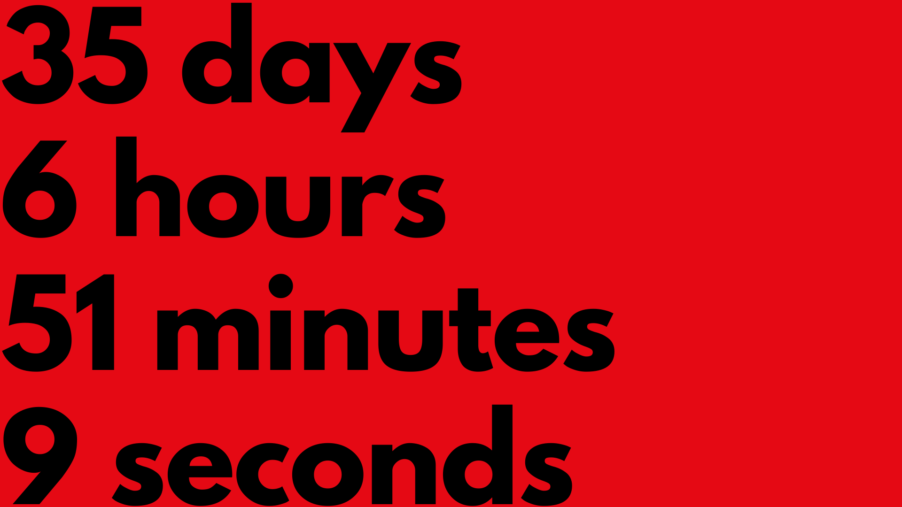
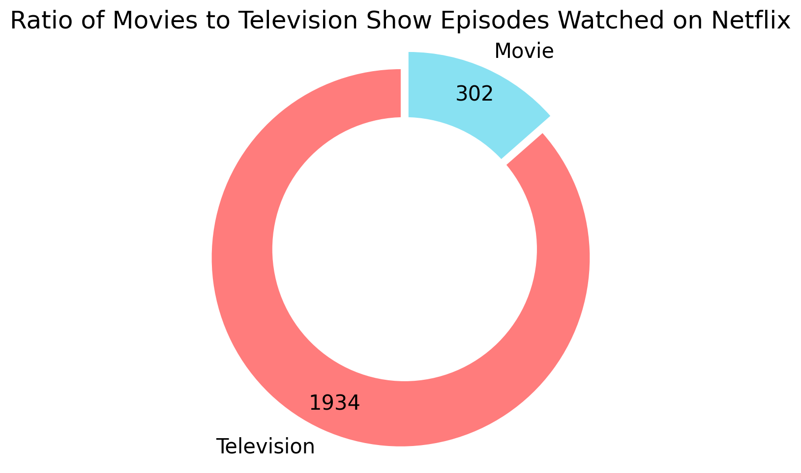
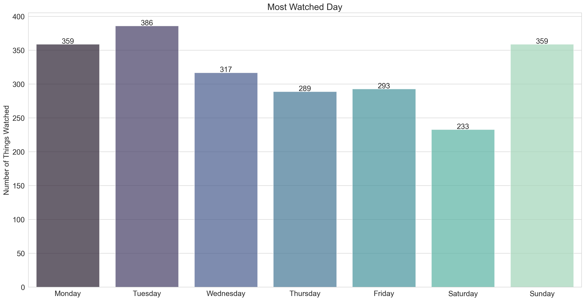
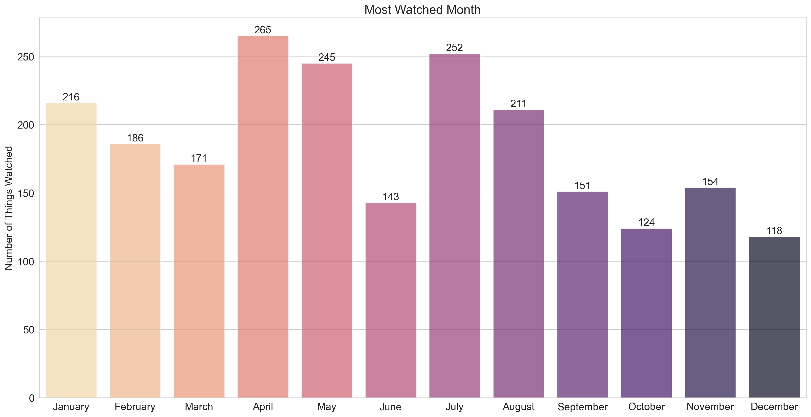
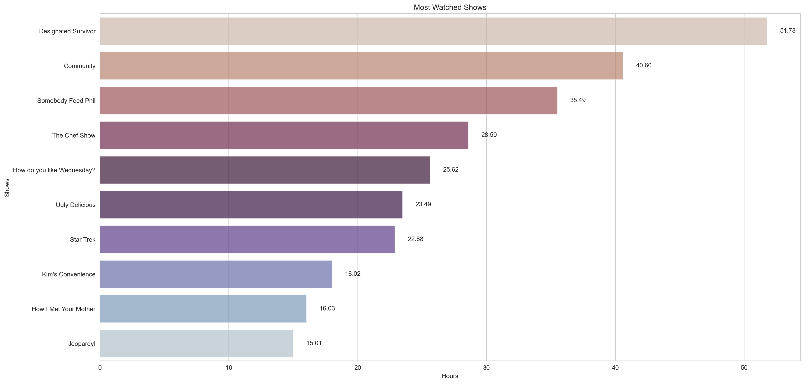

# "Some Genres Have Some Effects On Some Viewers"
A data analysis on my Netflix viewing habits.

## Introduction 

Streaming and video on demand services have become increasingly prevalent. I would argue more so than how prevalent television was. It is socially acceptable to "binge" shows and movies. And with all these shows and movies that we are watching, there has to be *some* effect on us. Wouldn't it be nice to get a glimpse of that effect?

And thanks to the sheer amount of data that Netflix keeps track of me. It is really easy to do so. Prior to this, recording the shows and movies you watched was a painstaking process of keeping notes on what you watched or rent a third-party device to record the television signal or the ambient audio in the room. 

But with the need to create highly curated, extremely targeted libraries of media to stream, streaming companies are keeping track of everything we do. So with a simple data request we can get access to a rather extensive record of our media comsumption habits. Intrusive? Maybe. Helpful? Yes.

The rest of this article will explore this treasure trove of data and attempt to glean something from it.

## Methodology

After retrieving the csv file with the records (information on how to accomplish this can be found elsewhere), it was necessary to clean the data to get a clear analysis of it. As the saying goes: "garbage in, garbage out".

One thing that had to be dealt with was the removal of all mentions of trailers, previews and hooks from the data. *Trailers* are pretty self-explanatory as to what they are. *Previews* refer to the small clip that starts playing for a specific thing when you are browsing. Whilst *hooks* are the small clips that you can actively watch to get a glimpse of a thing. 

Since we wanted to focus on the shows and movies we watched. Removing records for random things that we didn't properly watch was necessary.

Entries for shows and movies that had less than a minute of viewing time were also removed. Merely "channel surfing" shows and movies is not the same as watching shows and movies.

As a side note, I decided to remove quotation marks from titles. The quotation marks were originally there for titles that include commas. Since the data comes in a csv file and titles with commas would mess with the formatting. In remove the quotation marks, I also replaced the commas in the titles with the phrase "(comma)" as a clear distinction for the viewer.

### Oddities in the data

Whilst cleaning the data, I came across a few curious records. For one, the movie **Escape from L.A.** staring Kurt Russell as Snake Plissken had the title **Fuga Da Los Angeles**. The Italian title for the the movie. I can't really answer as to why this is the case.

Additionally, the Netflix documentary **Operation Varsity Blues: The College Admissions Scandal** uses non-breaking spaces but only in its subtitle **The College Admissions Scandal**. I do not know if this is some internal naming scheme for Netflix as no other movie features non-breaking spaces in their subtitle.

## Results

With that all out of the way, we can look at my findings.

*Note: data used for this analysis comprised of viewing from the start of 2019 to the end of 2020. Data used is not included with the code for this analysis*

Between 2019 and 2020, I ended up watching **thirty five days, six hours, fifty one minutes and nine seconds** worth of Netflix. In other words over 846 hours or over 50,000 minutes of Netflix over the span of two years. With a runtime of 686 minutes, I would be able to watch the **The Lord of the Rings: Extended Edition** more than **seventy four** times. Needless to say, a lot of watching.

Within those two years, I spent the majority of my time watching television shows. Rather unsurprisingly.

There is not much in the way of determing a **most popular day** where I used the most Netflix. The prevailing trend is how my viewing decreases throughout the week from Monday all the way to Saturday before shooting back up again on Sunday. 

My watching frequency by month matches the periods in which I had much more free time. But I cannot explain the drop in veiwing for the month of June. It comes in between two of the top three months by viewing whilst being the third lowest month in viewing.

My most watched show is **Designated Surviror** starring Kiefer Sutherland coming in at just under fifty two hours. Expected given that is the only show I would describe as a classic twenty four episode serial drama. My second most watched show and number one most watched sitcom is **Community** with under forty one hours of watchtime. Again, given the number of episodes and how I decided to watch most of them as fast as possible. This show would end up taking a chunk of my watchtime.

Remarkably or rather unremarkably given my affection for cooking and travelling, four of the ten most watched shows are cooking and travelling shows (**Somebody Feed Phil**, **The Chef Show**, **How do you like Wednesday** and **Ugly Delicious**).

**Jeopardy!** takes the number ten spot on the graph at just above fifteen hours of watchtime and the only gameshow on the graph.

## Closing Remarks

With the above insights, it already begins to describe the kind of person that I am. With more time and further analysis (time of day viewing, what combination of things will I watch in roughly the same period of time), we could peer deeper into my mind. Sadly, the records do not include genre information for each entry and unless I manually added genre information to the records obtained through third party services, there won't be any. The use of third party services may end up spoiling the data in the process (a third party service may classify a show as something that Netflix would not classify it as).

> Code used for this data analysis can be found [here](https://github.com/JonathanBNZZ/Personal-Netflix-Data-Analysis).
